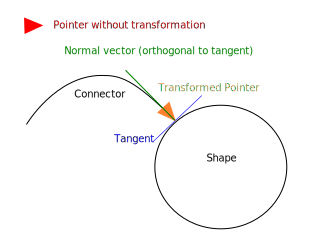
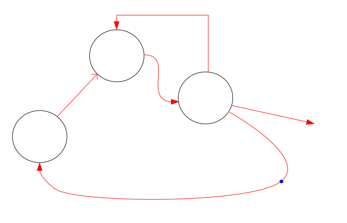

# Connector

Connector joins 2 points with a line.

## Connector start and end

Connector can start or end on a board or on an item.

## Point on an item

A point on an item is relative to the top left corner of the item bounding rectangle.

Connector uses the item to transform an item point to a point relative to the board.

## Additional points

Connector line can pass through any amount of intermediate points between the start and the end points.

## Pointer

Connector line starts and ends with one of the pointer shapes.

The pointer shape is tranformed (rotated and translated) so that its end is on the line end and its axis is on the normal vector of the shape in that point (is orthogonal to the tangent of the shape in that point).

## Line style

Line between points can be drawn using straight lines, bezier curves or orthogonal lines.

