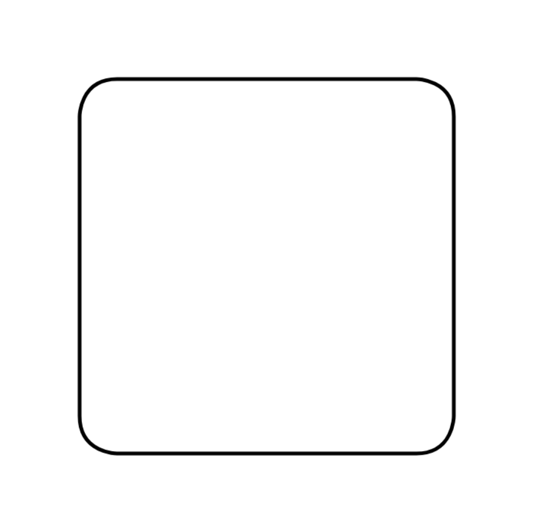

# Path

Path is used to draw shapes on a canvas. Path uses [Path2D](https://developer.mozilla.org/en-US/docs/Web/API/Path2D) to draw on a canvas and has methods to find answer about the shape geometry.

For a list of things to be done see the [TODO`s](TODO.md).

## To create shapes

Create a new path from any combination of [Arcs](../Arc/index.ts), [Curves](../Curve/index.ts) or [Lines](../Line/index.ts). You can close path to fill its background with a color. You can set border color and style.

```
const roundedRectangle = new Path(
	[
		new CubicBezier(
			new Point(0, 10),
			new Point(0, 10),
			new Point(10, 0),
			new Point(0, 0),
		),
		new Line(new Point(10, 0), new Point(90, 0)),
		new CubicBezier(
			new Point(90, 0),
			new Point(90, 0),
			new Point(100, 10),
			new Point(100, 0),
		),
		new Line(new Point(100, 10), new Point(100, 90)),
		new CubicBezier(
			new Point(100, 90),
			new Point(100, 90),
			new Point(90, 100),
			new Point(100, 100),
		),
		new Line(new Point(90, 100), new Point(10, 100)),
		new CubicBezier(
			new Point(10, 100),
			new Point(10, 100),
			new Point(0, 90),
			new Point(0, 100),
		),
		new Line(new Point(0, 90), new Point(0, 10)),
	],
	true,
]);
roundedRectangle.transformation.translateBy(100, 100);
roundedRectangle.transformation.scaleBy(5, 5);
```

It will produce the same shape as direct calls to [CanvasRenderingContext2D](https://developer.mozilla.org/en-US/docs/Web/API/CanvasRenderingContext2D):

```
const ctx = document.getElementById("canvas").getContext("2d");
ctx.beginPath();
ctx.translate(100, 100);
ctx.scale(5, 5);
ctx.strokeStyle = "rgb(0, 0, 0)";
ctx.lineWidth = 1;
ctx.moveTo(0, 10);
ctx.bezierCurveTo(0, 10, 0, 0, 10, 0);
ctx.lineTo(90, 0);
ctx.bezierCurveTo(90, 0, 100, 0, 100, 10);
ctx.lineTo(100, 90);
ctx.bezierCurveTo(100, 90, 100, 100, 90, 100);
ctx.lineTo(10, 100);
ctx.bezierCurveTo(10, 100, 0, 100, 0, 90);
ctx.lineTo(0, 10);
ctx.stroke();
```

## To draw shapes

To draw a shape call the render method with a [DrawingContext](../DrawingContext.ts).

```
const canvas = document.createElement("canvas");
const context = new DrawingContext(canvas.getDrawingContext("2d"));
roundedRectangle.render(context);
```



## To find shapes

To find answers about the shape geometry call its methods.
