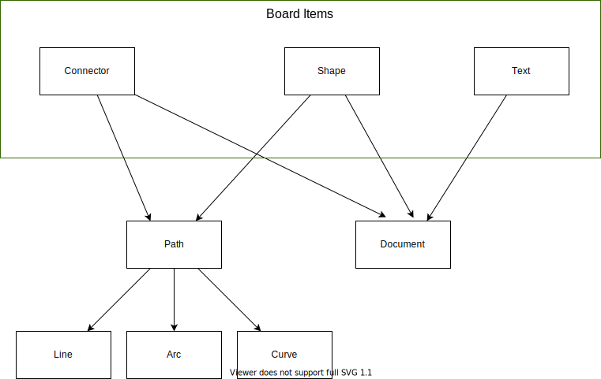

# Items

Items that can be added to a board.

All items implement a similar interface.

Each item can compute its own geometry to answer such questions as:

-   What is the item's bounding rectangle?
-   Is the item under a point?
-   What is the distance from the item to a point?
-   Where is the nearest point on the edges of the item to some point in space?

Each item can render itself on a canvas rendering context.

## Board Items

Board items (Shapes, Texts, Connectors) can be added to a board.

User can create and manipulate board items.

### Default values

Items values of an item are not specified at creation time the item is created with default values.

## Primitive items

Primitive items (Path, Document) are used to create board items.

### Path

Path is used to render vector graphics.

Path constists of an array of Arcs, Lines and Curves.

Path can be open or closed. Closed path can be filled with a color. A point can be inside of a closed path.

### Document

Document is used to render rich text on a canvas.

