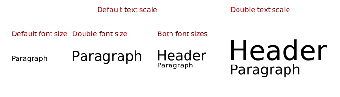

# Rich Text

An editable rich text.

## When the full text rendering/rerendering is done?

The full process of rendering the text to the DOM and then to the Canvas Document is done when:

-   the Text is rendered for the first time,
-   the Text Container width or height are changed,
-   the Text Nodes are changed.

## How the full text rendering/rerendering is done?

It is done in the following order:

1. The Text Renders to the DOM and measures it:

    1. creates the DIV Container for the HTML Element if it was not already created,

    2. sets maxWidth and maxHeigth of the DIV Container,

    3. renders Nodes as HTML Element inside of the DIV Container and measures the HTML Element width and height to set the Canvas Document width and height.

2. The Text transforms the Rectangle and gives the DOM Element to the Canvas Document:

    1. The Text scales the Rectangle, applies the Transformation to the Container and aligns the Rectangle inside of the Container.

    2. The Text gives the Text Element to Text Canvas Document to parse the DOM and create a new cached image.

3. The Canvas Document translates and scales the Drawing Context with the Text Rectangle translation and scale and calls the renderer on the Drawing Context.

## When the full text rerendering is skipped?

The full text rerendering is unnecessary when the text is only translated or scaled.

## How the quick rerendering is done?

The quick rerendering is done in the following order:

1. The Text

    1. scales the Rectangle,
    2. transforms the Container,
    3. aligns the Rectangle inside of the Container.

2. The Canvas Document translates and scales the Drawing Context with the Text Rectangle translation and scale and calls the renderer on the Drawing Context.

The text Container is scaled and translated with the Shape transformation.

## How the max width and height of are determined?

If the text Container is set: both max width and max height set to the text container width and height.

Else if the max width is set only it is used, else neither is used.

## How the max width and height of the text are used?

Both Text Editor and HTML Element are rendered with the max width and max height set according to the rules above.

## How the width and height of the text are measured?

Both the Text Editor and the HTML Element have the same resulting width and height that can be measured, but only the HTML Element is used in the measurment.

## How the text measured width and height are used?

After the text HTML Element is rendered

-   it is measured to get the text Mbr.

-   The text Mbr is then scaled with the text scale.

-   The text Mbr is aligned inside of the text Container if the container is set.

-   The text Mbr is translated with the text translation if the container is not set.

Once the HTML Element width and height are measured they a used to set the width and height of the Canvas Document.

## How the text descendant tree is rendered?

-   as a DOM Element in offscreen canvas to get an HTML Element for the Canvas Document
-   as a DOM Element in the Text Editor

## How the canvas document is transformed?

The Canvas Document is then scaled with the Text Scale, thus increasing its width and height.

After the scaling the Canvas Document is:

-   aligned inside of the Text Container if the Text Container is set.
-   translated with the Text Translation if the Text Container is not set.

## How the transformation is applied to the text?

When a Text is inside of a Shape:

-   the Shape has the Text and the Text Container
-   the Text and the Shape have the same Transformation
-   the Transformation does not reflect the text translation or scale
-   the Transfotmation reflects the text`s container translation and scale
-   the Text translation is its rect left top point.
-   the Text scale is unchanged.

When a Text is outside of a Shape:

-   the Text has a Transformation that reflects the Text translation.

## How the font size is scaled?

The text font size can be set for the whole text or for each text node.

The text node font size is multiplied by the whole text font size to get its effective font size.

The text can be scaled proportionally, thus increasing the whole text font size.

The text can be scaled over the horisontal axis, thus changing the the text max width.

The transformation scale is never applied to the text font size.

The effective font size is never actually set on the text HTML Element. Instead the text HTML Element is rendered with the node font size. The whole text is then transformed with the scale of the text computed as the ratio of the whole text font size to the default text font size.

